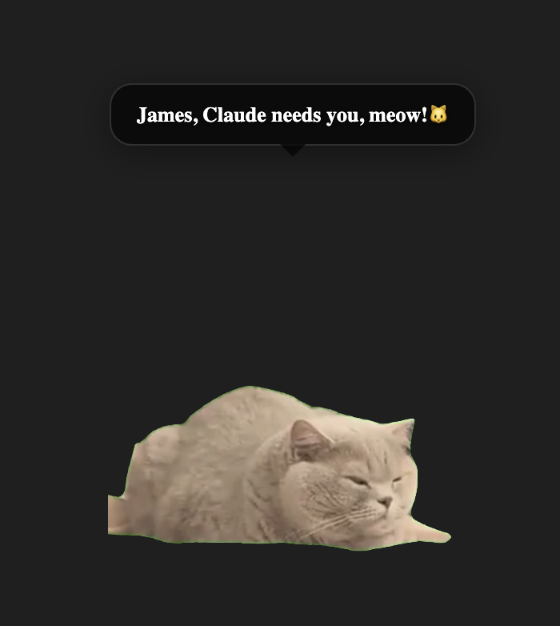
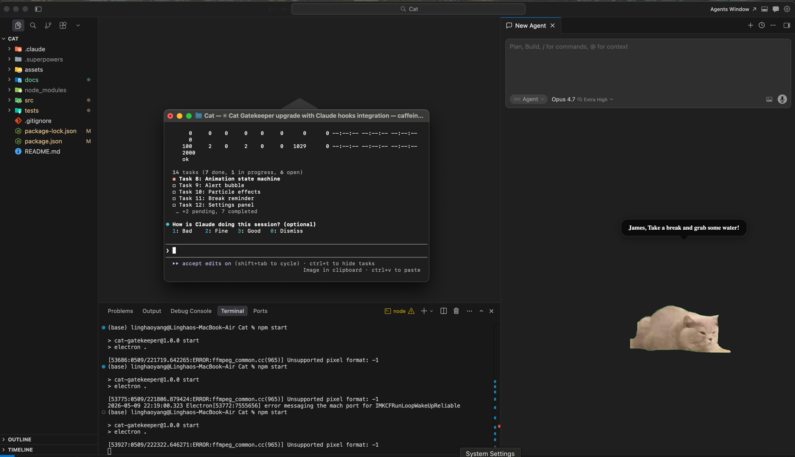

# Claude Cat 🐱

> A desktop cat that keeps you company while you work — and jumps to get your attention when Claude Code needs a click.





---

You miss having a pet around while you work. Something alive in the corner of your screen. A little presence that makes the day feel less like staring into a void.

Claude Cat is that. A small cat that lives on your desktop, does its thing, and keeps you company through the long hours.

And when Claude Code gets stuck waiting for your input — instead of silently freezing for 30 minutes while you're in another tab — your cat **jumps up and yells at you**.

No more coming back 30 minutes later to find Claude has been frozen on a permission prompt the whole time. Nothing written. Session wasted.

---

## What It Does

**Companion** — a small cat lives on your desktop while you work. Drag it anywhere. Hover to interact (play, feed, pet). Upload your own cat GIF or video to make it yours.

**Watchdog** — hooks into Claude Code's notification system. The moment Claude needs your input, your cat jumps and shows an alert bubble with your name on it.

**Break reminder** — been staring at the screen for 45 minutes? Your cat will let you know.

---

## Getting Started

### Requirements

- macOS
- [Node.js](https://nodejs.org/) v18+
- [Claude Code](https://claude.ai/code) installed

### Install & Run

```bash
git clone https://github.com/JaimeYeung/Claude-Cat.git
cd Claude-Cat
npm install
npm start
```

### Setup

1. Right-click the cat → **Settings**
2. Upload a cat animation under **Assets → Main animation** (GIF, PNG, or MP4)
3. Under **Claude Code**, click **Install** to connect the notification hook
4. Done — your cat is now watching Claude Code for you

---

## Customization

Make it feel like yours:

- **Your cat's name** and **what it calls you** — shown in every alert bubble
- **Custom alert messages** — write whatever you want your cat to say
- **Cat size** — 80px to 400px, drag the slider
- **Optional animations** for play / feed / pet interactions
- **Sound** — upload an MP3/WAV to play on alerts
- **Language** — English / 中文

---

## How the Hook Works

Claude Cat installs a [Claude Code Notification hook](https://docs.anthropic.com/en/docs/claude-code/hooks) into `~/.claude/settings.json`. When Claude Code needs your attention, it fires a `curl` to a local server running inside the app, which triggers the cat animation.

The hook is automatically removed when you quit.

```json
{
  "hooks": {
    "Notification": [{
      "hooks": [{
        "type": "command",
        "command": "curl -s http://localhost:7777/cat-gatekeeper || true"
      }]
    }]
  }
}
```

---

## Build a DMG

```bash
npm run build
# → dist/Cat Gatekeeper-1.0.0.dmg
```

---

*Claude Cat is an independent open-source project, not affiliated with or endorsed by Anthropic. Claude is a trademark of Anthropic.*
